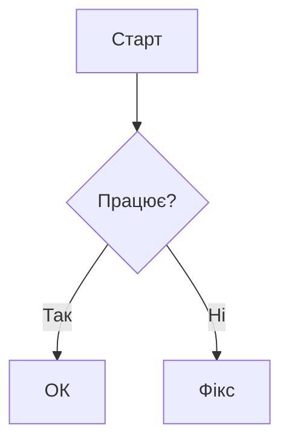

# Лабораторна робота №1: Демонстрація Markdown

## 1. Форматування тексту
Це **жирний текст**, а це *курсив*.  
Можна комбінувати: ***жирний курсив***.  
Також є ~~закреслений текст~~.

## 2. Списки
### Морковный:
- Елемент 1
- Елемент 2
  - Підпункт 2.1

### Нумерований:
1. Перший крок
2. Другий крок

### Задачі:
- [ ] Виконано
- [x] Не виконано

## 3. Посилання та зображення
[Посилання на Google](https://www.google.com)


## 4. Код
Рядковий: `print("Hello")`

Блок коду:
```python
def hello():
    print("Hello, GitHub!")
```

## 5. Таблиця
| Ім'я   | Вік |
| ------ | --- |
| Настя  | 18  |
| Михаил | 18  |
| Андрей | 20  |

## 6. Цитата
> Це важлива примітка.

## 7. Діаграма Mermaid
